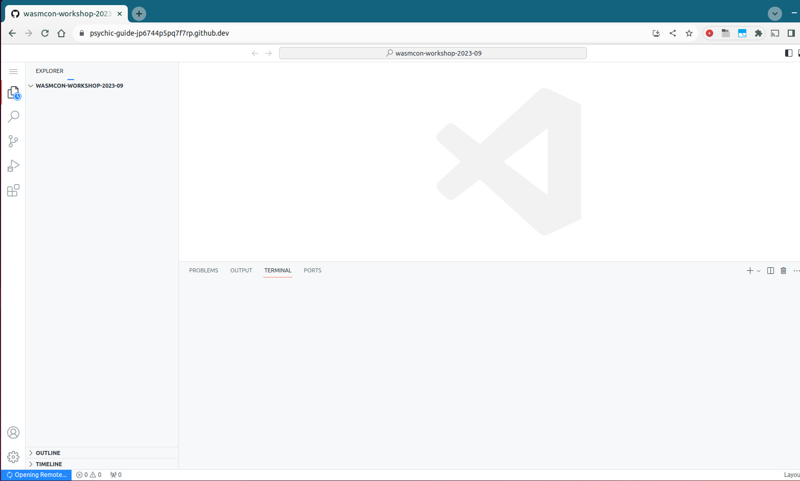
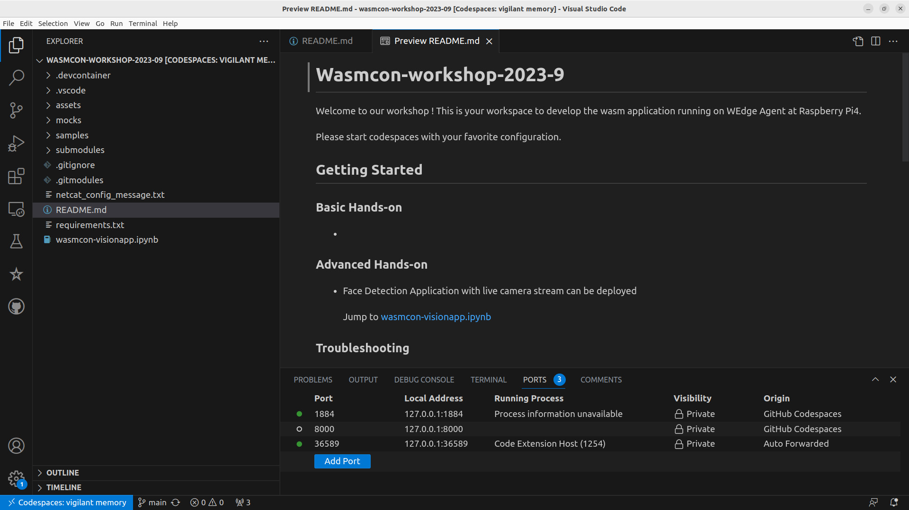
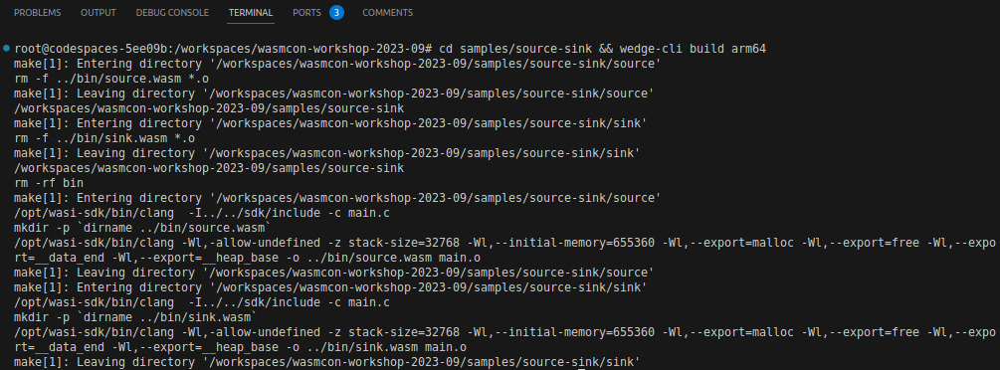
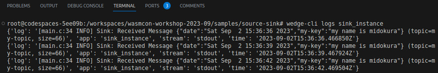

# Wasmcon-workshop-2023-9
   

Welcome to our workshop ! This is your workspace to develop the wasm application running on WEdge Agent at Raspberry Pi4.

Please start codespace by following the prerequisites below.


## Getting Started

### Prerequisites

#### 1. Creating codespace

- **Step 1.** Go to the repository *wasmcon-workshop-2023-09* (https://github.com/midokura/wasmcon-workshop-2023-09)
- **Step 2.** Click "Code" → "Codespaces" → … → “+ New with options…”

   

- **Step 3.** Click "Create codespace"
   <br><br>
   It might take some minutes to build the container at the first time.
   <br><br>

- **Step 4.** VS Code is displayed on the web-browser
   <br>
   Some installations will be automatically executed on the TERMINAL. Please wait until all installation is done. It would take a minute.
   

- **Step 5.** Click "setup" on the popup "No LLDB instance found. Setup now?"
   <br><br>

#### 2. Opening Codespace in VS Code Desktop

- **Step 1.** Click the menu on left corner, then click “Open in VS Code Desktop”
   <br>
- **Step 2.** Click the “Open Visual Studio Code - URL Handler” in the popup
   <br>
- **Step 3.** Click the "Open"
   <br><br>
   Now you can access the codespace container from your VS Code on your laptop.
   <br><br>
   You can close the tab on the web-browser.
   <br><br>

#### 3. Confirming Port Forwarding

- **Step 1.** Start New Terminal on your VS Code on your laptop
   <br><br>

- **Step 2.** Go to the “PORTS” tab, then confirm the settings of port forwarding are as attached
   <br>

   We use 1884 instead of 1883 to avoid conflict with the user's personal MQTT.

#### 4. Sending Configuration of MQTT to Raspberry Pi

In this section, we are sending configuration of MQTT to Raspberry Pi so that the Raspberry Pi can access to the MQTT brocker running in the codespace.

- **Step 1.** On another window/tab in your browser, go to [http://your-designated-raspberrypi-host:9000](http://your-designated-raspberrypi-host:9000)
- **Step 2.** Click on the link to your designated target port. You should get the following kind of message:
   ```
    Configuration to port {target port} has been successful!
   ```

### Basic Hands-on
   Now you are ready to use wedge-cli. Please go to your Codespace VS Code on your laptop.
   

#### 1. Displaying Help Message
   ```bash
   wedge-cli -h
   wedge-cli deploy -h
   ```

#### 2. Getting Deployment Status
   ```bash
   wedge-cli get deployment
   ```
   

#### 3. Building Sample WASM Applications "source-sink"
- **Step 1.** Change configuration. Please set your laptop IP address.
   ```bash
   wedge-cli config set webserver.host="YOUR LAPTOP IP ADDRESS"
   ```
   The Raspberry Pi will use the IP address to download the built WASM applications.
- **Step 2.** Build applications from the application directory.
   ```bash
   cd samples/source-sink && wedge-cli build arm64
   ```
   <br>
   You can find the built applications as below.
   <br>

#### 4. Deploying the Built WASM Applications to Raspberry Pi
- **Step 1.** Deploy the built applications to the Raspberry Pi
   ```bash
   wedge-cli -v deploy
   ```
   

   ```bash
   wedge-cli get deployment
   ```
   

   **Note:**<br>
    If you get the timeout message "WARNING: Timeout when sending modules.", please make sure if you set your laptop IP address correctly in the above section. You can check the current configuration by executing:
   ```bash
   wedge-cli config get webserver.host
   ```

#### 5. Getting Telemetry Sent from "sink" WASM Application

```bash
wedge-cli get telemetry
```


#### 6. Getting Log of "sink" WASM Application
In this section, we are getting logs of the "sink" WASM application.

- **Step 1.** Find the instance name of the sink by running get deployment, or just adding “_instance” to the name of the application.
   ```bash
   wedge-cli get deployment
   ```
   <br>
   You can find the ‘sink_instance’ in the 'deploymentStatus'.

- **Step 2.** Run the following command to get the logs of the "sink"
   ```bash
   wedge-cli logs sink_instance
   ```
   

#### 7. Updating the "source" WASM Application

In this section, we are modifying the “send_message” function in the “source” application to update payload message.

- **Step 1.** Modify the source code of the "source" WASM application

   /workspaces/wedge-cli/samples/source-sink/source/main.c

   Line 43, updating the string “my-value” to any word.

   

   Before:
   ```
      sprintf(d->payload, "{\"date\":\"%s\",\"my-key\":\"my-value\"}", date);
   ```
   After:
   ```
      sprintf(d->payload, "{\"date\":\"%s\",\"my-key\":\"my name is midokura\"}", date);
   ```

- **Step 2.** Build the application again
   ```bash
   cd samples/source-sink
   wedge-cli build arm64
   ```

- **Step 3.** Remove the existing applications
   ```bash
   wedge-cli deploy -e
   ```

- **Step 4.** Deploy the built application
   ```bash
   wedge-cli -v deploy
   ```
   

- **Step 4.** Get the new deployment status
   ```bash
   wedge-cli get deployment
   ```
   

- **Step 5.** Get telemetry (i.e. data sent by the application)

   The message should be changed.<br>
   

- **Step 6.** Get logs
   ```bash
   wedge-cli logs sink_instance
   ```
   

#### 8. Creating a New WASM Application

- **Step 1.** Create a new template application

   If we set "hello" as the application name, the command is as below.
   ```bash
   wedge-cli new hello
   ```
   The "hello" folder is created as below.

   

- **Step 2.** Build the application
   ```bash
   cd hello/hello
   wedge-cli build arm64
   ```

- **Step 3.** Remove the existing applications
   ```bash
   wedge-cli deploy -e
   ```

- **Step 4.** Deploy the built application
   ```bash
   wedge-cli -v deploy
   ```

### Advanced Hands-on
- Face Detection Application with live camera stream can be deployed

   Jump to
   [wasmcon-visionapp.ipynb](./wasmcon-visionapp.ipynb)


### Troubleshooting

1. No response from wedge-cli

   If you already run mqtt broker in your local machine, you will get failed because WEdge Agent may be trying to connect there.

   Please stop your mqtt broker during the workshop. example for mosquitto on linux

   ```bash
   sudo systemctl stop mosquitto.service
   ```

   If it is difficult, don't worry. codespaces automatically allocate different port as port-forwarding.
   Please check the forwarded port in the bottom of codespaces window. There is the "PORTS" and see the port information and set it mqtt.port via WEdge CLI.

2. Download never finished
   If you have a firewall between host and device, it might block module download.

   Please allow the port to pass the firewall. example for ufw on linux

   ```bash
   sudo ufw allow <port>
   sudo ufw enable
   ```
