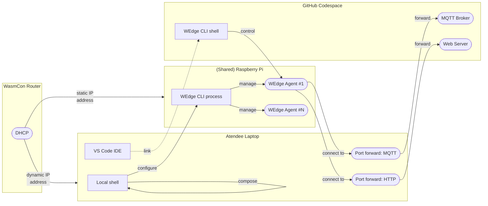
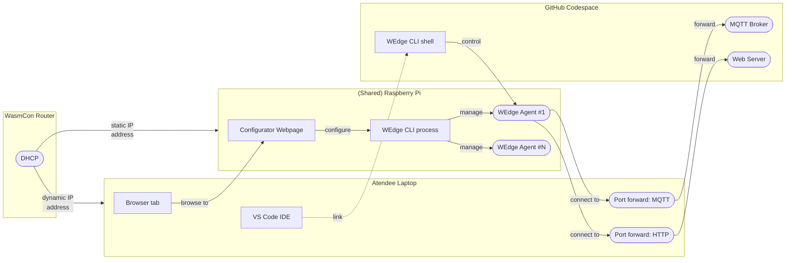

# Workshop setup

## Current setup

The current setup requires the atendee to:
1. Compose a configuration file that contains the MQTT broker and target device's IP addresses, as well as a port that is assigned for each device.
2. Execute a command using `netcat`, a shell-based tool that may not be available in every attendee's machine.

### Diagram




# An alternative setup for the workshop

It is proposed as a way to reduce the error surface area for atendees trying to replicate the experience on their own laptops.

Advantages are:
1. No manual composition of a JSON config file
2. No need for command-line tools such as `netcat`.

## Basic proposal

- Deploy a simple python script, called the _Configurator_, that exposes a HTTP server with a single endpoint.
- The endpoint automatically generates the WEdge CLI configuration, and submits it to the WEdge CLI process that is already listening on the Raspberry Pi.

### What we would require

Two actions:
1. Deploy the script and its configuration (e.g. systemd unit) to the Raspberry Pis, via a script running e.g `rsync` or `scp` and configuring via SSH, on every one, from a single machine.
2. Update the workshop documentation (e.g. [README.md](README.md) and [wasmcon-visionapp.ipynb](wasmcon-visionapp.ipynb)) and push to the repo.

### Diagram



### Development speedup

1. The systemd unit file has already been written
2. The script to deploy the solution to all Raspberry Pis in parallel has already been written
3. For the actual webserver source, just make ChatGPT write the Configurator with the following prompt, and then tweak it:

```
I need a python script that uses only the stdlib modules, that fulfills the following specifications:
1. It exposes a HTTP server, which provides the following endpoints: / (the root), /inst0, /inst1, /inst2
2. When a client queries this server for the root endpoint with verb GET, it returns a string containing:
  - On the first line, the IP address of the client
  - On the next line, a link to the endpoint /inst0
  - On the next line, a link to the endpoint /inst1
  - On the next line, a link to the endpoint /inst2
3. When a client queries this server for the /inst0 endpoint with verb GET, it will call a function that receives as arguments: the client's IP address and the number 8100.
4. When a client queries this server for the /inst1 endpoint with verb GET, it will call the same function as for /inst0, with the arguments: the client's IP address and the number 8101.
4. When a client queries this server for the /inst2 endpoint with verb GET, it will call the same function as for /inst0, with the arguments: the client's IP address and the number 8102
```
